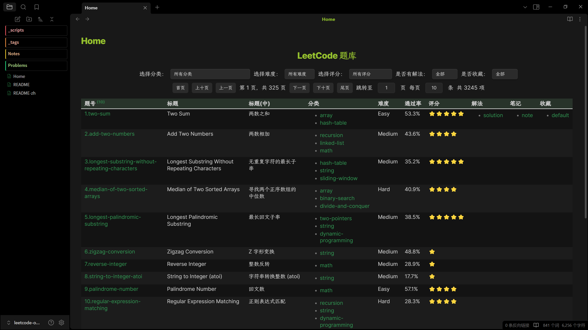
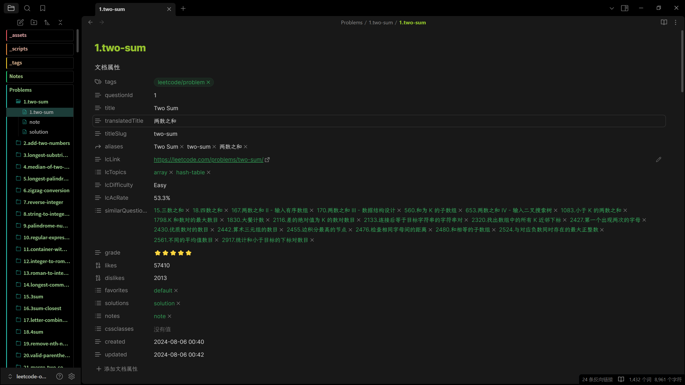
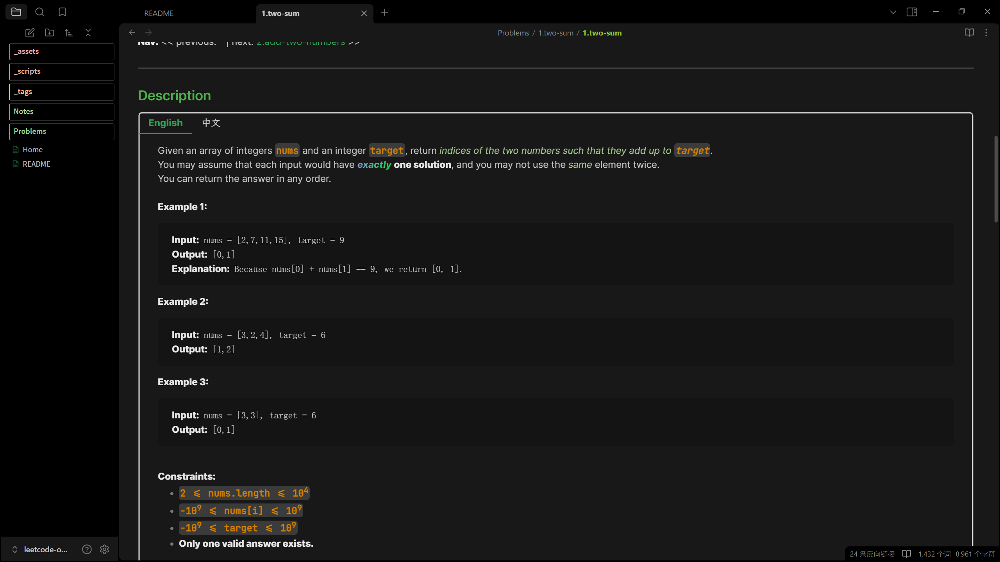
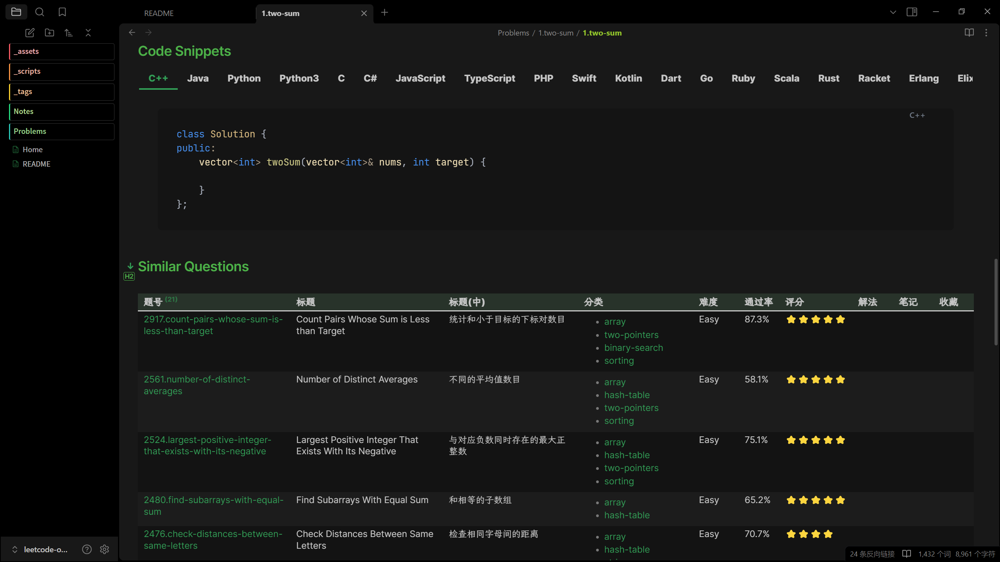
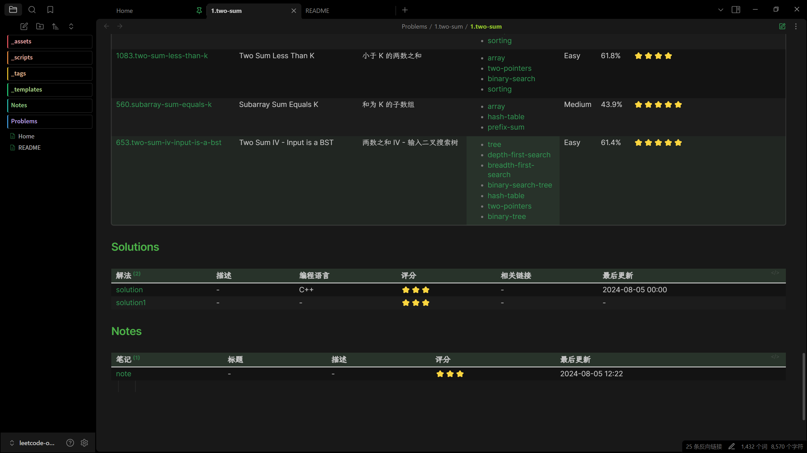

# LeetCode Obsidian 知识库

一个用于组织管理 LeetCode 题目和解答的 Obsidian 知识库，支持双语、丰富的元数据和智能导航。

> 如果对你有帮助，欢迎点个 Star ⭐

[English](README.md) | 简体中文

## ✨ 特性

- 📝 **双语支持**: 中英文题目描述
- 🏷️ **丰富元数据**: 主题标签、难度、通过率、相似题目
- 🔗 **智能导航**: 上一题/下一题链接，方便顺序刷题
- 📊 **交互表格**: 基于 Dataview 的题目列表和统计
- 🎯 **主题分类**: 按算法主题和模式组织
- ⭐ **质量评分**: 基于社区反馈的题目评分

## 📸 界面预览











## 🚀 快速开始

### 普通用户

只想使用笔记库？仅需安装 Obsidian！

**方式一：直接使用本仓库**

1. 克隆并用 Obsidian 打开
   ```bash
   git clone https://github.com/sean2077/leetcode-obvault.git
   ```
2. 在 Obsidian 中打开文件夹作为仓库

**方式二：集成到已有仓库**

1. 复制 `leetcode/` 文件夹到你的仓库
2. 修改所有主题文件中的脚本路径（如 `leetcode/lc-topic/*.md`）：
   - 将 `leetcode/dv_pagingTable` 改为你的实际脚本路径
   - 例如：`Yourleetcode/dv_pagingTable`
3. 安装所需的 Obsidian 插件:
   - [Dataview](https://github.com/blacksmithgu/obsidian-dataview)（必需）
   - [Tabs](https://github.com/xhuajin/obsidian-tabs)（必需）
   - (可选) 其他你喜欢的插件

### 维护者

需要生成/更新题目卡片？

**前置要求:**
- Python 3.8+
- 必需的包:
  ```bash
  pip install typer rich natsort
  ```

### 使用方法

**浏览题目**
- 进入 `leetcode/lc-problems/` 查看单个题目卡片
- 查看 `leetcode/lc-topic/` 按主题分类的题目

## 🛠️ 生成题目卡片

> **注意:** 本节仅适用于需要生成或更新题目卡片的维护者。

本项目使用 [leetcode-problems](https://github.com/sean2077/leetcode-problems) 项目爬取的数据，通过 [.tools/generate_leetcode_cards.py](.tools/generate_leetcode_cards.py) 脚本生成 Obsidian 笔记。

### 生成单个题目

```bash
python .tools/generate_leetcode_cards.py single \
  --en path/to/problem.json \
  --cn path/to/problem-cn.json \
  -o output.md
```

### 批量生成

```bash
python .tools/generate_leetcode_cards.py batch \
  --problems-dir .ref/leetcode-problems/problems \
  --problems-cn-dir .ref/leetcode-problems/problems-cn \
  --output-dir leetcode/lc-problems
```

### ⚠️ 重要提示

> 建议将生成的题目卡片作为**引用笔记**，不要直接编辑，以免更新时被覆盖。

个人笔记和解答请创建单独的文件，并链接到题目卡片。

## 🎨 自定义

你可以根据个人需求修改生成脚本：

- 自定义元数据字段
- 调整 Markdown 格式
- 添加自定义章节
- 修改链接样式

## 📁 项目结构

```
leetcode-obvault/
├── .tools/                    # 生成脚本
│   └── generate_leetcode_cards.py
├── leetcode/
│   ├── _scripts/             # Dataview 脚本
│   ├── lc-problems/          # 题目卡片
│   ├── lc-topic/             # 主题页面
│   └── lc-favorite/          # 收藏集
└── README.md
```

## 🤝 贡献

欢迎贡献！你可以：

- 报告 Bug
- 建议新功能
- 提交 PR
- 分享你的自定义方案

## 📄 许可与免责声明

本项目仅供**学习和交流使用**，请勿用于商业用途。

题目和内容均来自 [LeetCode](https://leetcode.com/) 网站，版权归原作者所有。如有侵权，请联系删除。

