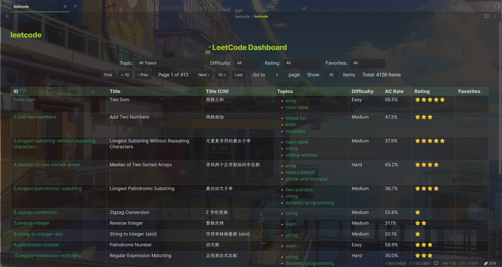
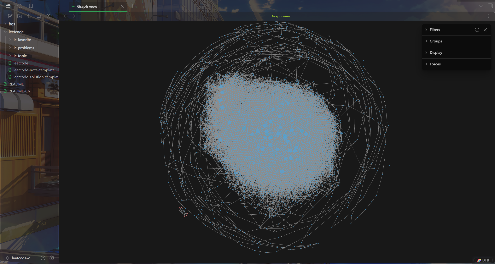

# LeetCode Obsidian Vault

An Obsidian vault for organizing LeetCode problems and solutions with rich metadata, bilingual support, and smart navigation.

> If you find this project helpful, please give it a ⭐ star!

English | [简体中文](README-CN.md)

## ✨ Features

- 📝 **Bilingual Support**: English and Chinese problem descriptions
- 🏷️ **Rich Metadata**: Topics, difficulty, acceptance rate, similar problems
- 🔗 **Smart Navigation**: Previous/Next problem links for sequential learning
- 📊 **Interactive Tables**: Dataview-powered problem lists and statistics
- 🎯 **Topic Organization**: Organized by algorithm topics and patterns
- ⭐ **Quality Ratings**: Problem ratings based on community feedback

## Why I made this

I wanted my LeetCode learning to live in my own note system where I can:
- Reference problems in my study notes
- See connections between problems and concepts
- Track progress my way
- Have everything in one place

The vault comes with a Python script if you want to regenerate or customize the cards yourself.

## 📸 Screenshots

**Dashboard**



**Problem Card**

.png)

.png)

.png)

**Topic Card**


**Graph View**



## 🚀 Quick Start

### For Regular Users

Just want to use the vault? Only Obsidian is required!

**Option 1: Use this vault directly**

1. Clone and open in Obsidian
   ```bash
   git clone https://github.com/sean2077/leetcode-obvault.git
   ```
2. Open the folder as a vault in Obsidian

**Option 2: Integrate into your vault**

1. Copy the `leetcode/` folder to your vault
2. Update the script path in all topic files (e.g., `leetcode/lc-topic/*.md`):
   - Change `leetcode/dv_pagingTable` to your actual script path
   - Example: `Yourleetcode/dv_pagingTable`
3. Install required Obsidian plugins:
   - [Dataview](https://github.com/blacksmithgu/obsidian-dataview) (Required)
   - [Tabs](https://github.com/xhuajin/obsidian-tabs) (Required)
   - (Optional) Other plugins you prefer

### For Maintainers

Need to generate/update problem cards?

**Prerequisites:**
- Python 3.8+
- Required packages:
  ```bash
  pip install typer rich natsort
  ```

### Usage

**Browse problems**
- Navigate to `leetcode/lc-problems/` for individual problem cards
- Check `leetcode/lc-topic/` for topic-based organization

## 🛠️ Generating Problem Cards

> **Note:** This section is only for maintainers who want to generate or update problem cards.

This project uses data from [leetcode-problems](https://github.com/sean2077/leetcode-problems) and generates Obsidian notes using the [.tools/generate_leetcode_cards.py](.tools/generate_leetcode_cards.py) script.

### Generate Single Problem

```bash
python .tools/generate_leetcode_cards.py single \
  --en path/to/problem.json \
  --cn path/to/problem-cn.json \
  -o output.md
```

### Batch Generate

```bash
python .tools/generate_leetcode_cards.py batch \
  --problems-dir .ref/leetcode-problems/problems \
  --problems-cn-dir .ref/leetcode-problems/problems-cn \
  --output-dir leetcode/lc-problems
```

### ⚠️ Important Note

> It is recommended to treat generated problem cards as **reference notes**. Avoid editing them directly to prevent data loss during updates.

For personal notes and solutions, create separate files and link them to the problem cards.

## 🎨 Customization

You can modify the generation script to fit your personal needs:

- Customize frontmatter fields
- Adjust markdown formatting
- Add custom sections
- Change link styles

## 📁 Project Structure

```
leetcode-obvault/
├── .tools/                    # Generation scripts
│   └── generate_leetcode_cards.py
├── leetcode/
│   ├── _scripts/             # Dataview scripts
│   ├── lc-problems/          # Problem cards
│   ├── lc-topic/             # Topic pages
│   └── lc-favorite/          # Favorite collections
└── README.md
```

## 🤝 Contributing

Contributions are welcome! Feel free to:

- Report bugs
- Suggest new features
- Submit pull requests
- Share your customizations

## 📄 License & Disclaimer

This project is for **educational and learning purposes only**. Please do not use it for commercial purposes.

All problems and content are sourced from [LeetCode](https://leetcode.com/), and the copyright belongs to the original authors. If there is any infringement, please contact for removal.

